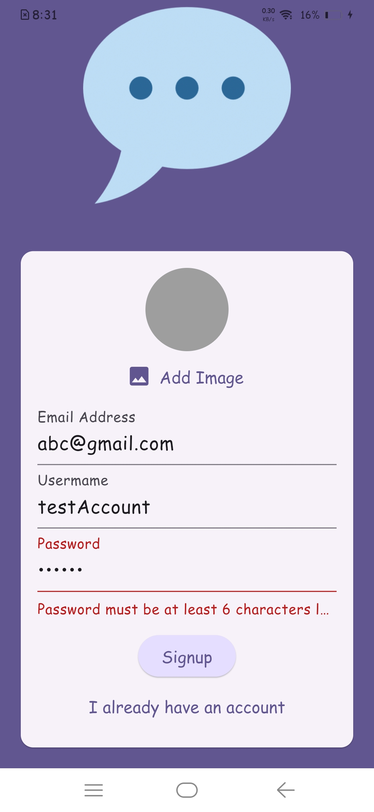
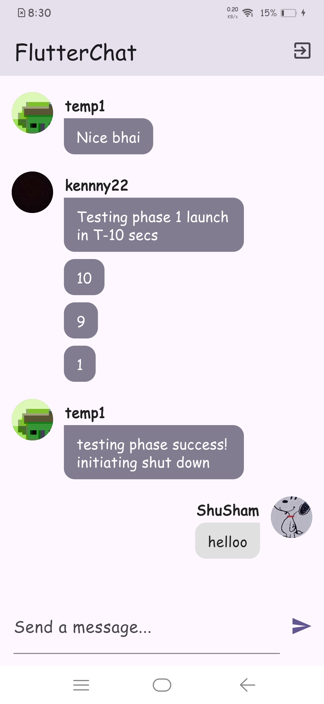
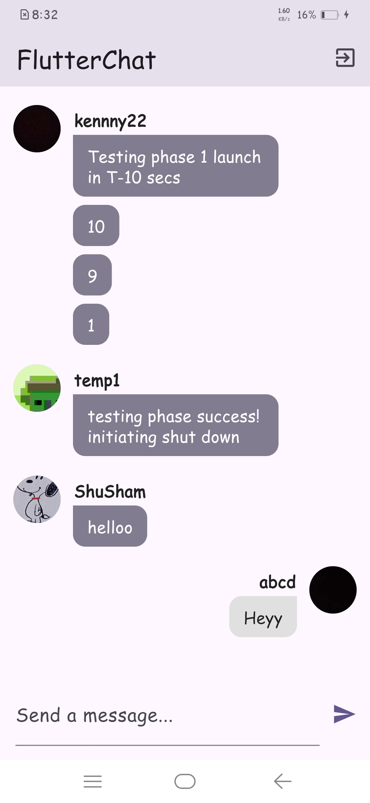

# Chat App

🚀 A modern, real-time chat application built with Flutter and Firebase. This app allows users to sign up, log in, and chat in real-time with other users.

## Features

- 🔐 **User Authentication**: Secure sign-up and login using Firebase Authentication.
- 💬 **Real-time Chat**: Instant messaging with Firebase Firestore.
- 🔔 **Push Notifications**: Receive notifications for new messages using Firebase Cloud Messaging.
- 👤 **User Profiles**: Upload and display user profile images.

## Tech Stack

- **Flutter**: UI framework
- **Firebase**:
  - **Firebase Authentication**: For user authentication
  - **Firebase Firestore**: For real-time database
  - **Firebase Storage**: For storing user images
  - **Firebase Cloud Messaging**: For push notifications

## Screenshots





## Installation

1. Clone the repository:
   ```bash
   git clone https://github.com/yourusername/chat_app.git
   ```

2. Navigate to the project directory:
   ```bash
   cd chat_app
   ```

3. Install dependencies:
   ```bash
   flutter pub get
   ```

4. Run the app:
   ```bash
   flutter run
   ```

## Project Structure

- **lib/**: Contains the Dart code for the app.
  - **main.dart**: Entry point of the application.
  - **screens/**: Contains the main screens of the app.
    - **auth.dart**: Handles user authentication.
    - **chat.dart**: Displays the chat interface.
  - **widgets/**: Contains reusable widgets.
    - **message_bubble.dart**: Displays individual chat messages.
    - **new_message.dart**: Allows users to send new messages.
    - **user_image_picker.dart**: Allows users to pick and upload profile images.

## Contributing

Contributions are welcome! Please feel free to submit a Pull Request.

## License

This project is licensed under the MIT License - see the LICENSE file for details.
