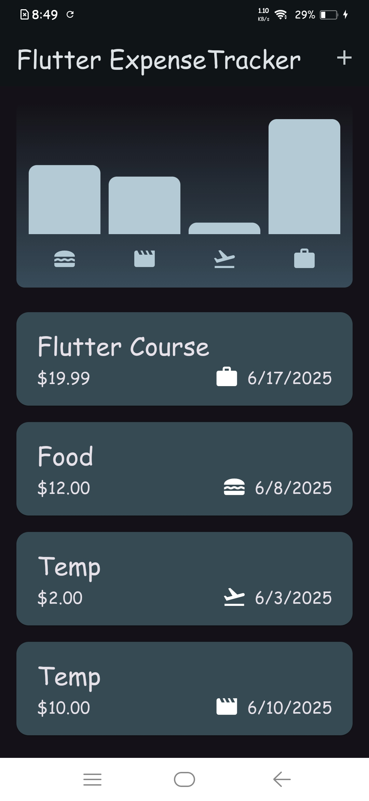
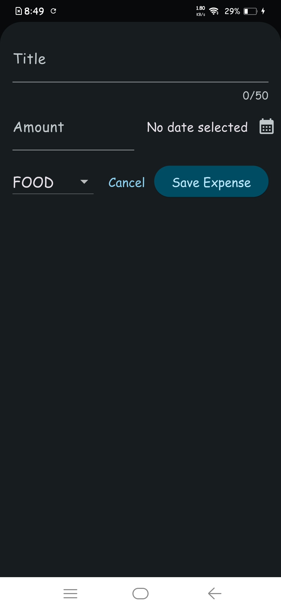

# Expense Tracker 💸

A simple and modern expense tracking app built with Flutter. Easily add, view, and manage your daily expenses, and visualize your spending habits with interactive charts.

---

## ✨ Features

- ➕ Add new expenses with title, amount, date, and category
- 📋 View a list of all expenses
- 🗑️ Remove expenses with an undo option
- 📊 Visualize expenses by category using a bar chart
- 📱 Responsive design for mobile and tablet/desktop
- 🌗 Light and dark mode support

---

## 🖼️ Screenshots

| 🏠 Home Screen           | ➕ Add Expense Screen      |
|----------------------|------------------------|
|  |  |

---

## 🚀 Getting Started

### Prerequisites
- [Flutter SDK](https://flutter.dev/docs/get-started/install)
- Dart

### Installation

1. **Clone the repository:**
   ```bash
   git clone https://github.com/your-username/expense_tracker.git
   cd expense_tracker
   ```
2. **Install dependencies:**
   ```bash
   flutter pub get
   ```
3. **Run the app:**
   ```bash
   flutter run
   ```

---

## 📁 Project Structure

```
lib/
  main.dart                # App entry point
  models/expense.dart      # Expense model and category logic
  widgets/
    chart/                 # Chart and chart bar widgets
    expenses_list/         # Expense list, item, and add expense widgets
    expenses.dart          # Main expenses screen
```

---

## 🤝 Contributing

Contributions are welcome! Please open issues or submit pull requests for improvements and bug fixes.

---

## 📝 License

This project is licensed under the MIT License.
